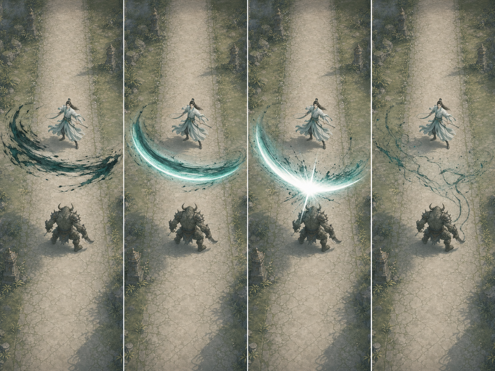
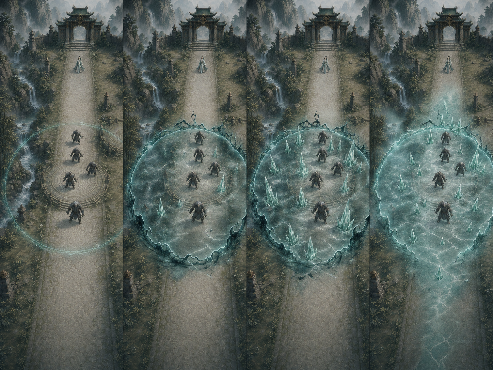
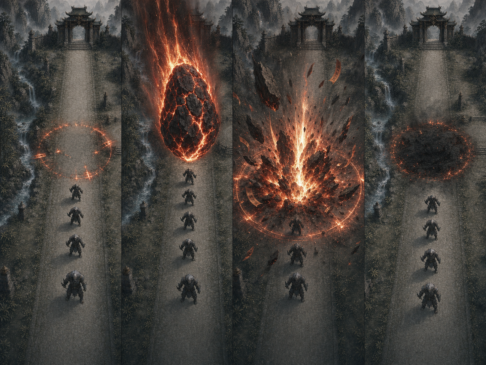
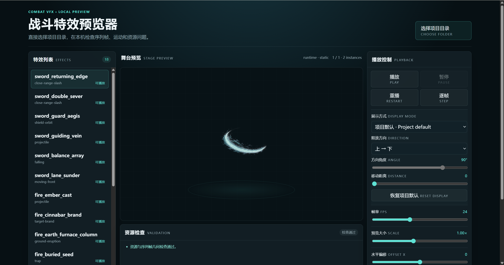

# Creating 2D Game Combat VFX

[简体中文](README.md) | [English](README.en.md)

A reusable ChatGPT Skill for taking game combat effects from visual direction to production-ready integration and acceptance. It captures a complete workflow proven on sword, fire, and water ability families: visual design, sprite-sheet production, semantic playback, configuration export, hidden GM testing, regression tests, and device-level visual review.

## Visual references

These storyboards demonstrate how the Skill maps gameplay semantics to motion and residue phases. Created with ChatGPT, they define the visual direction and keyframe relationships used to produce the final effects.

### Cloud Crane's Return: close-range arc

The wind-up, formed slash, impact accent, and ink-like residue preserve a consistent silhouette and brightness hierarchy across the sequence.



### Mystic Ice Domain: persistent ground zone

The effect establishes its boundary, freezes the ground, grows ice formations, and settles into an animated persistent state.



### Celestial Meteor: falling meteor impact

The warning seal, airborne meteor, ground impact, and scorched residue each communicate anticipation, travel, hit, and cleanup.



### VFX previewer

The local previewer brings together the effect list, stage playback, resource validation, and display controls so sprite frames, direction, distance, anchors, and layer choreography can be checked before game integration.



## Why this project exists

Game VFX requirements should be defined and produced according to the game's visual style and the actual behavior of each ability, including its attack direction, range, and related gameplay constraints. This Skill separates combat mechanics from visual presentation, turns ability designs into visual concepts, develops those concepts step by step into production-ready effects, and finally integrates them into the project for an efficient VFX production workflow.

## What this skill covers

- Project-specific visual direction and four-stage storyboards
- Transparent PNG sprite-sheet requirements and exposure control
- Semantic playback archetypes for slashes, projectiles, volleys, moving fronts, falling objects, eruptions, persistent zones, traps, brands, beams, and orbiting shields
- Separate moving body, locked ground anchor, local trail, and timestamped impact state
- Spreadsheet-driven scale, offset, width, radius, and export verification
- Hidden GM/debug access for isolated spell playback
- Automated renderer and combat-mechanics regression tests
- Simulator or device frame capture and final acceptance criteria

## Seven-stage workflow

1. **Requirements analysis:** Record ability semantics, target scope, project constraints, and the existing assets, renderer, configuration, tests, and debug entry points.
2. **Visual design:** Define the art direction, four-stage storyboard, and acceptance criteria; pause for approval after this stage by default.
3. **Asset production:** Produce transparent sprite sequences, layered resources, and the effect manifest from the approved design.
4. **Resource preview:** Check resources in the local previewer and record issues and adjustment decisions; pause for approval again after this stage by default.
5. **Game integration:** Connect previewed resources to motion models, anchors, lifecycle events, and authoritative tuning without changing combat mechanics.
6. **Test tooling:** Add independent GM/debug playback and verify configuration export.
7. **Acceptance optimization:** Complete visual acceptance and combat regression tests, correct issues, and deliver the final report.

## Repository structure

```text
SKILL.md                              Core agent workflow and completion gate
agents/openai.yaml                    Codex UI metadata and default invocation
references/visual-design.md           Art direction and storyboard rules
references/asset-production.md        Sprite-sheet, alpha, and export standards
references/runtime-integration.md     Motion archetypes and visual-state contracts
references/config-and-export.md       Configuration and table export workflow
references/qa-and-acceptance.md       Automated and visual acceptance criteria
references/preview-workflow.md        Local resource preview, inspection, and approval workflow
assets/effect-manifest.example.json   Internal effect manifest template used by the Skill
docs/reference-images/                Combat VFX storyboard images used by the repository overview
scripts/validate_effect_manifest.mjs  Deterministic internal manifest validator
tools/vfx-preview/                    Zero-install local HTML VFX previewer
tests/                                Routing, manifest logic, and preview-page regression tests
```

## Usage

Install or link this folder in your Codex skills directory, then invoke:

```text
Use $creating-game-combat-vfx to design, produce, and integrate the complete combat VFX for this ability set.
```

Ordinary users do not need to copy templates, edit JSON, or run commands. Describe the goal, scope, and whether game integration is required; the Skill assesses existing outputs and dependencies, proposes the relevant stages, and waits for your selection instead of running every stage indiscriminately.

## Usage examples

### Complete request

The user provides only the goal and scope:

> Use `$creating-game-combat-vfx` to design complete combat VFX for sword, fire, and water ability sets. Approve the visual direction first, then produce authored sprite assets and integrate them without changing existing damage mechanics. Expose scale and offsets for tuning, and verify every ability through the hidden GM panel.

For a complete request, the Skill's first response lists the seven selectable stages and marks each one as already satisfied, recommended, or blocked by a missing dependency:

1. Requirements analysis
2. Visual design
3. Asset production
4. Resource preview
5. Game integration
6. Test tooling
7. Acceptance optimization

You can reply with:

- `run all stages`
- `complete the first three stages`
- `only stages 2 and 4`
- `continue from stage 5`

Choosing `run all stages` still pauses for approval after stage 2, visual design, and stage 4, resource preview. The Skill skips these two checkpoints only when you explicitly request uninterrupted execution. When continuing from a later stage, it reuses checked designs and resources and adds only required dependencies.

### Partial request

If you need only one part of the workflow, ask for it directly. For example:

> Use `$creating-game-combat-vfx` to only preview existing VFX resources.

The Skill enters stage 4, resource preview, directly. If readable resources or a manifest are missing, it explains and adds only the minimum required dependencies instead of repeating completed visual design or asset production.

### Start the local previewer

Open `tools/vfx-preview/index.html` directly in a browser, then select the resource directory containing the effect manifest and PNG files. The project's build or export pipeline should automatically emit `effect-manifest.preview.json` beside the runtime assets, so no one has to copy or maintain a second configuration manually. No dependency installation, server, or network connection is required. Missing resources and similar errors are isolated so other valid effects in the same directory remain playable.

The previewer first uses the project default display profile from the manifest, including motion, direction, distance, duration, anchors, and layer choreography. For another project or a temporary comparison, use the display-mode, direction, and distance controls as a manual override. A manual override affects only the current preview and does not modify the manifest or PNG files; switching effects or choosing “Reset to project default” clears it. Use this preview for resource-stage checks, while final acceptance must still happen in game with the real scale, camera, and blend behavior.

Read the reference file named by `SKILL.md` before performing each production stage. Do not declare completion until automated mechanics tests and final gameplay-scale visual captures both pass.

## Design principle

Keep combat authoritative and presentation replaceable:

- combat actors own targets, collision, damage, penetration, ticks, buffs, and healing;
- visual actors own position, ground anchors, trails, spawn height, scale, and offsets;
- visual events own timestamped impacts, pulses, shatters, and one-shot lifetimes.

This separation is the foundation for effects that look correct without destabilizing gameplay.
